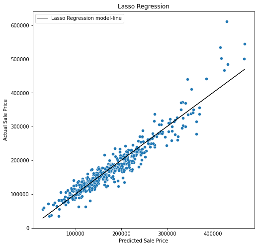
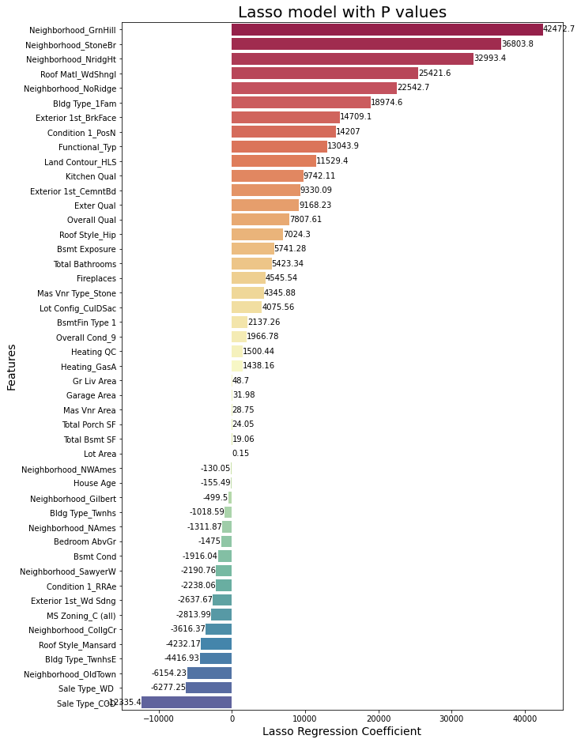
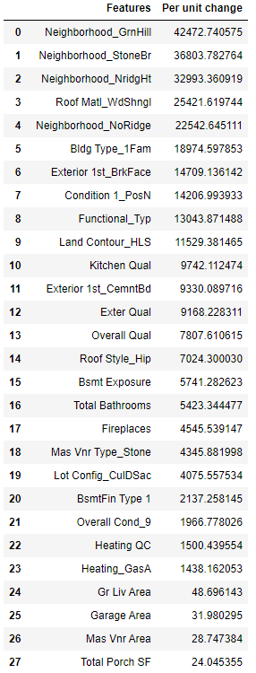
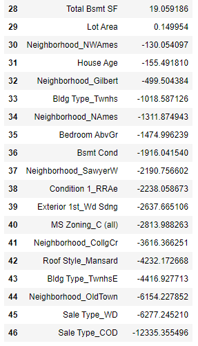

#  Project 2 - Ames Housing Data and Kaggle Challenge

### Overview

In this project, we are tasked to create a regression model to predict the price of a house at sale.
The dataset used for the project is the Ames Housing datasets which is one of the most popular datasets on Kaggle, consisting of the training and test data.

Ames is a small city in the state of Iowa in the United States which the Iowa State University is located. 
The Ames housing dataset examine over 70 different features of houses sold in Ames, Iowa during 2006 - 2010 with the train data containing the sale price while the test data not having any sale price.

### Datasets

There are 3 datasets and 1 text file included in the [`data`](./data/) folder for this project.

* [`train.csv`](./data/act_2019.csv): Training dataset 
* [`test.csv`](./data/sat_2019.csv): Test dataset 
* [`data_description.txt`](./data/data_description.txt): Full description of each column, originally prepared by Dean De Cock but lightly edited to match the column names used here
* [`sample_submission.csv`](./data/sat_2019_ca.csv): Benchmark submission from a linear regression on year and month of sale, lot square footage, and number of bedrooms

### Data fields

Here's a brief version of what you'll find in the data description file.

* SalePrice - the property's sale price in dollars. This is the target variable that you're trying to predict.
* MSSubClass: The building class
* MSZoning: The general zoning classification
* LotFrontage: Linear feet of street connected to property
* LotArea: Lot size in square feet
* Street: Type of road access
* Alley: Type of alley access
* LotShape: General shape of property
* LandContour: Flatness of the property
* Utilities: Type of utilities available
* LotConfig: Lot configuration
* LandSlope: Slope of property
* Neighborhood: Physical locations within Ames city limits
* Condition1: Proximity to main road or railroad
* Condition2: Proximity to main road or railroad (if a second is present)
* BldgType: Type of dwelling
* HouseStyle: Style of dwelling
* OverallQual: Overall material and finish quality
* OverallCond: Overall condition rating
* YearBuilt: Original construction date
* YearRemodAdd: Remodel date
* RoofStyle: Type of roof
* RoofMatl: Roof material
* Exterior1st: Exterior covering on house
* Exterior2nd: Exterior covering on house (if more than one material)
* MasVnrType: Masonry veneer type
* MasVnrArea: Masonry veneer area in square feet
* ExterQual: Exterior material quality
* ExterCond: Present condition of the material on the exterior
* Foundation: Type of foundation
* BsmtQual: Height of the basement
* BsmtCond: General condition of the basement
* BsmtExposure: Walkout or garden level basement walls
* BsmtFinType1: Quality of basement finished area
* BsmtFinSF1: Type 1 finished square feet
* BsmtFinType2: Quality of second finished area (if present)
* BsmtFinSF2: Type 2 finished square feet
* BsmtUnfSF: Unfinished square feet of basement area
* TotalBsmtSF: Total square feet of basement area
* Heating: Type of heating
* HeatingQC: Heating quality and condition
* CentralAir: Central air conditioning
* Electrical: Electrical system
* 1stFlrSF: First Floor square feet
* 2ndFlrSF: Second floor square feet
* LowQualFinSF: Low quality finished square feet (all floors)
* GrLivArea: Above grade (ground) living area square feet
* BsmtFullBath: Basement full bathrooms
* BsmtHalfBath: Basement half bathrooms
* FullBath: Full bathrooms above grade
* HalfBath: Half baths above grade
* Bedroom: Number of bedrooms above basement level
* Kitchen: Number of kitchens
* KitchenQual: Kitchen quality
* TotRmsAbvGrd: Total rooms above grade (does not include bathrooms)
* Functional: Home functionality rating
* Fireplaces: Number of fireplaces
* FireplaceQu: Fireplace quality
* GarageType: Garage location
* GarageYrBlt: Year garage was built
* GarageFinish: Interior finish of the garage
* GarageCars: Size of garage in car capacity
* GarageArea: Size of garage in square feet
* GarageQual: Garage quality
* GarageCond: Garage condition
* PavedDrive: Paved driveway
* WoodDeckSF: Wood deck area in square feet
* OpenPorchSF: Open porch area in square feet
* EnclosedPorch: Enclosed porch area in square feet
* 3SsnPorch: Three season porch area in square feet
* ScreenPorch: Screen porch area in square feet
* PoolArea: Pool area in square feet
* PoolQC: Pool quality
* Fence: Fence quality
* MiscFeature: Miscellaneous feature not covered in other categories
* MiscVal: $Value of miscellaneous feature
* MoSold: Month Sold
* YrSold: Year Sold
* SaleType: Type of sale
* SaleCondition: Condition of sale

---

### Problem Statement and Executive summary
We are a team of data scientists working in real estate consultancy based in Iowa to advise clients (investors and homeowners) on opportunities to optimise sale price (buy and sell) for houses in Ames.

To create the regression model to assist our clients, the following workflow was being carried out:

Exploratory Data analysis
- Descriptive summary of datasets
- Identified Categorical and Numerical features
- Determine missing values in features

Exploratory Visualisation
- Distribution of target variable
- Correlation between features and sale price
- Scatter plots for visualisation of continuous features to Sale price
- Box plots for visualisation of categorical features to Sale price

Data cleaning
- Removal of outliers
- Imputation of null values
- Creation of new features 
- Removal of multicollinearity between features

Pre-processing 
- One-hot encoding of categorical variables
- Min Max scaling of numerical variables
- Transformation of Ordinal features to Numeric values
- Train, test, split of Training data

Modelling 
- Establish baseline score of linear regression model
- Parameters pipeline creation
- Hyperparameters tuning with Gridsearching
- Identification of suitable model
- Determine features coefficients of the model

### Model Selection
To create the model. A linear regression model was first created before Gridsearch was then used to find the optimal hyperparameters for the model which is as follows:

|Model|MSE (MinMax)|
|:---|:---|
|Lasso (α = 100)|-2.21%|

This fulfills the criteria of a generalisation score less than 5% signifying that the model is not overfitted to our training data.

To validate and evaluate our model performance, we must ensure that it adheres to the LINE assumptions of a linear regression model. 
By plotting the predicted to actual sale price, there is a strong linear correlation between the model prediction and actual result. 
In terms of normality, the residuals are normally distributed. 
The residuals are also equally distributed and clusters towards the middle of the plot which fulfills the homoscedasticity assumption of the model. 

By running the model on the Test data, we are able to provide a price prediction for every house and the model was submitted to Kaggle for evaluation of its Kaggle score.

### Recommendations

The cost impact per unit change of each variables is shown on the table above. 

In essence, neighbourhoods are a key features in house prices with houses from `Green Hill`, `Stone Brook`, `Northridge Heights` and `North Ridge` tend to fetch a higher average sale price of about $20,000 to $40,000 with all else being equal. 
Building type such as 1Fam (Single-family detached) and Hill side properties also add value to the home significantly

Conversely, houses sold under Warranty Deed and Court officer deed also hurt the value of a home.

Home improvement projects such as upgrading the roof material to Wood Shingles can improve the house value by about $25,000. 
By adding an additional fireplace or bathrooms, homeowners can also bump up the price by $5,000.

### Limitation and Conclusion
Although this model generalise well to the City of Ames, it might not perform as well on other cities due to a difference in features such as the neighbourhoods. 
To make this model more universal, we will have to eliminate features that are unique to Ames such as the Neighbourhoods. 
Other features such as fireplace or porch may not be useful to other cities which have no need for them due to the weather or housing style. 
